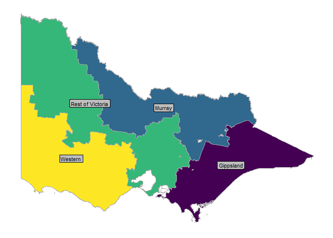

<!-- README.md is generated from README.Rmd. Please edit that file -->

# vicdairymap

<!-- badges: start -->
<!-- badges: end -->

vicdairymap is a simple package containing sf objects for the Victorian
dairy regions

Victoria has three - Western, Gippsland and Murray - made up of are
groups of local government areas.

We have used this simple aggregation approach to create sf objects by
summarising objects obtained using `strayr::read_absmap("lga2021")`

Local government areas outside of the non-dairy regions are assigned to
a ‘Rest of Victoria’ region.

## Installation

You can install the development version of vicdairymap from
[GitHub](https://github.com/) with:

``` r
# install.packages("devtools")
devtools::install_github("zerogetsamgow/vicdairymap")
```

## region_map

The following plot shows a map of the four regions which are contained
in `vicdairymap::dairy_region_map`.

The three dairy regions are labelled.

``` r
library(vicdairymap)
library(sf)
#> Linking to GEOS 3.11.2, GDAL 3.8.2, PROJ 9.3.1; sf_use_s2() is
#> TRUE
## basic region_map
ggplot2::ggplot() +
  ggplot2::geom_sf(
    data = vicdairymap::dairy_region_map,
    ggplot2::aes(
      geometry = geometry,
      fill = region_name,
    ),  
   colour = "darkgrey"
   )+
  ggplot2::geom_label(
    data = 
      vicdairymap::dairy_region_map, 
    ggplot2::aes(
      label = region_name,
      x = cent_long,
      y = cent_lat
    ),
    colour = "black", fill = "grey", size = 3) +
  ggplot2::scale_fill_viridis_d(guide = "none") +
  ggthemes::theme_map() +
  ggplot2::theme(
    legend.position.inside = c(.7,.7)
  )
#> Warning: Removed 1 row containing missing values or values outside the
#> scale range (`geom_label()`).
```



## region_tbl

The package contains a third dataset `vicdairymap::region_tbl` which
shows the mapping of local government areas to regions.

``` r
## print full table of regions, areas and lgas
knitr::kable(
  dairy_region_tbl
)
```

| region_name      | lga_name             | is_dairy |
|:-----------------|:---------------------|:---------|
| Rest of Victoria | Banyule              | FALSE    |
| Rest of Victoria | Bayside              | FALSE    |
| Rest of Victoria | Boroondara           | FALSE    |
| Rest of Victoria | Brimbank             | FALSE    |
| Rest of Victoria | Cardinia             | FALSE    |
| Rest of Victoria | Casey                | FALSE    |
| Rest of Victoria | Central Goldfields   | FALSE    |
| Rest of Victoria | Darebin              | FALSE    |
| Rest of Victoria | Frankston            | FALSE    |
| Rest of Victoria | Glen Eira            | FALSE    |
| Rest of Victoria | Greater Dandenong    | FALSE    |
| Rest of Victoria | Greater Geelong      | FALSE    |
| Rest of Victoria | Hobsons Bay          | FALSE    |
| Rest of Victoria | Hume                 | FALSE    |
| Rest of Victoria | Kingston             | FALSE    |
| Rest of Victoria | Knox                 | FALSE    |
| Rest of Victoria | Macedon Ranges       | FALSE    |
| Rest of Victoria | Manningham           | FALSE    |
| Rest of Victoria | Maribyrnong          | FALSE    |
| Rest of Victoria | Maroondah            | FALSE    |
| Rest of Victoria | Melbourne            | FALSE    |
| Rest of Victoria | Melton               | FALSE    |
| Rest of Victoria | Merri-bek            | FALSE    |
| Rest of Victoria | Mitchell             | FALSE    |
| Rest of Victoria | Monash               | FALSE    |
| Rest of Victoria | Moonee Valley        | FALSE    |
| Rest of Victoria | Mornington Peninsula | FALSE    |
| Rest of Victoria | Mount Alexander      | FALSE    |
| Rest of Victoria | Murrindindi          | FALSE    |
| Rest of Victoria | Nillumbik            | FALSE    |
| Rest of Victoria | Port Phillip         | FALSE    |
| Rest of Victoria | Queenscliffe         | FALSE    |
| Rest of Victoria | Stonnington          | FALSE    |
| Rest of Victoria | Strathbogie          | FALSE    |
| Rest of Victoria | Whitehorse           | FALSE    |
| Rest of Victoria | Whittlesea           | FALSE    |
| Rest of Victoria | Wyndham              | FALSE    |
| Rest of Victoria | Yarra                | FALSE    |
| Rest of Victoria | Yarra Ranges         | FALSE    |
| Gippsland        | Bass Coast           | TRUE     |
| Gippsland        | Baw Baw              | TRUE     |
| Gippsland        | East Gippsland       | TRUE     |
| Gippsland        | Latrobe              | TRUE     |
| Gippsland        | South Gippsland      | TRUE     |
| Gippsland        | Wellington           | TRUE     |
| Murray           | Alpine               | TRUE     |
| Murray           | Benalla              | TRUE     |
| Murray           | Campaspe             | TRUE     |
| Murray           | Gannawarra           | TRUE     |
| Murray           | Greater Bendigo      | TRUE     |
| Murray           | Greater Shepparton   | TRUE     |
| Murray           | Indigo               | TRUE     |
| Murray           | Loddon               | TRUE     |
| Murray           | Mansfield            | TRUE     |
| Murray           | Moira                | TRUE     |
| Murray           | Swan Hill            | TRUE     |
| Murray           | Towong               | TRUE     |
| Murray           | Wangaratta           | TRUE     |
| Murray           | Wodonga              | TRUE     |
| Rest of Victoria | Buloke               | FALSE    |
| Rest of Victoria | Hindmarsh            | FALSE    |
| Rest of Victoria | Mildura              | FALSE    |
| Rest of Victoria | Northern Grampians   | FALSE    |
| Rest of Victoria | Yarriambiack         | FALSE    |
| Western          | Ararat               | TRUE     |
| Western          | Ballarat             | TRUE     |
| Western          | Colac Otway          | TRUE     |
| Western          | Corangamite          | TRUE     |
| Western          | Glenelg              | TRUE     |
| Western          | Golden Plains        | TRUE     |
| Western          | Hepburn              | TRUE     |
| Western          | Horsham              | TRUE     |
| Western          | Moorabool            | TRUE     |
| Western          | Moyne                | TRUE     |
| Western          | Pyrenees             | TRUE     |
| Western          | Southern Grampians   | TRUE     |
| Western          | Surf Coast           | TRUE     |
| Western          | Warrnambool          | TRUE     |
| Western          | West Wimmera         | TRUE     |
